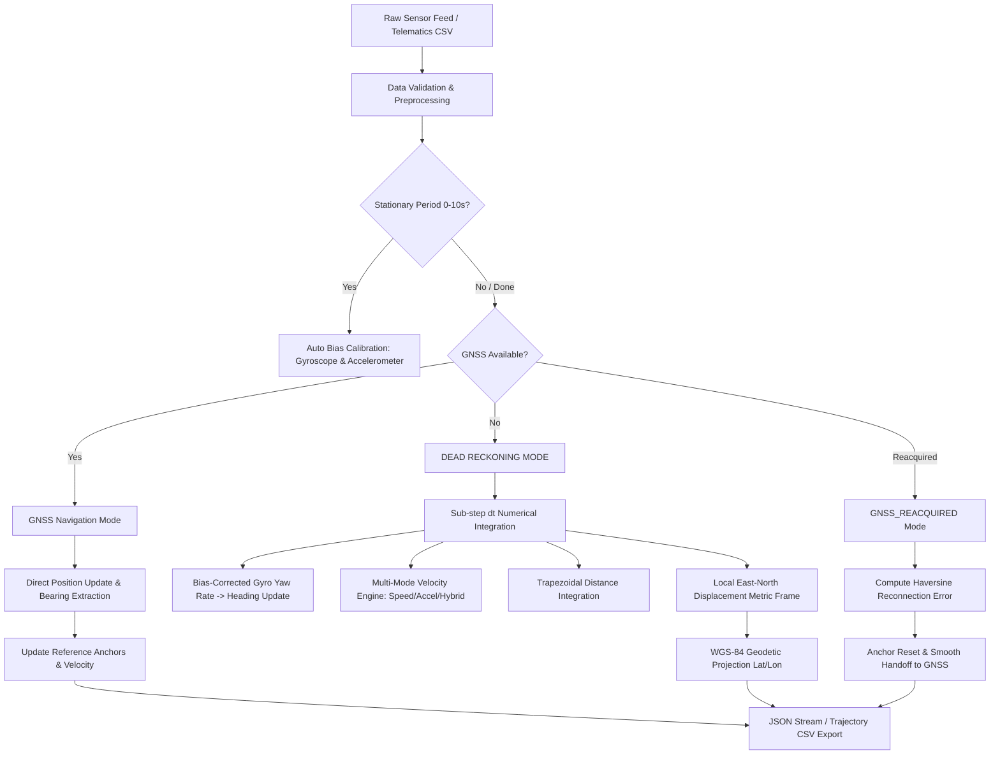

# Intelligent Vehicle Navigation During GNSS Outages

**Problem Statement:** PS 26168  
**Project Domain:** Inertial Navigation Systems (INS), Kinematic Dead Reckoning & Sensor Fusion  
**Target Application:** Autonomous Vehicles, Fleet Telematics & In-Cabin Navigation Systems

---

## 📌 Executive Overview

Satellite-based positioning systems (GNSS / GPS) are susceptible to degradation and complete signal loss in environments such as **underground tunnels, multi-level parking structures, dense urban canyons (high-rise corridors), deep mountain valleys, and areas subjected to electromagnetic interference or intentional spoofing/jamming**.

When GNSS signals drop, conventional navigation systems freeze or lose localization accuracy. This project implements a **robust, production-grade, physics-based Kinematic Dead Reckoning (DR) Engine**. It continuously monitors GNSS signal availability, executes automated sensor bias calibration, and—upon detecting a GNSS outage—seamlessly switches to high-frequency inertial sensor integration (3-axis accelerometer and 3-axis gyroscope) to propagate vehicle heading, speed, local metric coordinates, and geodetic WGS-84 position until satellite connectivity is reacquired.



---

## 🚀 Key System Features

1. **Deterministic Navigation State Machine**
   - Manages four distinct operational states: `UNINITIALIZED`, `GNSS`, `DEAD_RECKONING`, and `GNSS_REACQUIRED`.
   - Guaranteed atomic state handoffs with zero coordinate jumping.

2. **Automated Zero-Velocity Bias Calibration**
   - Automatically detects stationary periods ($v < 0.15\text{ m/s}$) during the initial observation window ($0\text{s}–10\text{s}$).
   - Computes empirical mean sensor biases for gyroscope yaw rate ($b_z$) and forward accelerometer ($b_a$), mitigating cumulative linear and quadratic drift.

3. **Multi-Mode Velocity Estimation Architecture**
   - **`sensor_speed`**: Uses independent odometer/wheel-speed sensor measurements.
   - **`acceleration`**: Numerically integrates bias-corrected forward acceleration ($v_t = v_{t-1} + a \cdot \Delta t$) with exponential low-pass filtering.
   - **`hybrid`**: Dynamically blends sensor speed and integrated acceleration via tunable parameter $\alpha_{\text{blend}}$, achieving optimal balance between responsiveness and noise resilience.

4. **WGS-84 $\leftrightarrow$ Local Metric Coordinate Transformations**
   - Converts global latitude/longitude pairs into a Cartesian East-North metric frame centered on the initial GNSS anchor.
   - Propagates displacement in metric units and projects back to WGS-84 geodetic coordinates via spherical Earth trigonometry ($R = 6,371,000\text{ m}$).

5. **Strict Anti-GPS-Leakage Architecture**
   - Enforces an absolute isolation barrier during GNSS outages: GPS latitude, longitude, satellite-derived heading, and GPS-derived speeds are blocked from entering the integration pipeline during outages.
   - Verified by automated regression tests guaranteeing bitwise-identical dead reckoning outputs regardless of corrupted GPS values during outage windows.

6. **Automated Reconnection Error Telemetry**
   - Computes great-circle Haversine distance error at the exact moment GNSS connectivity is reacquired, providing a concrete metric for trajectory drift evaluation.

7. **Dual-Execution Interface (Batch & Real-Time Streaming)**
   - **Batch DataFrame Processor**: High-throughput processing of complete telemetry runs with data validation and quality flagging.
   - **Real-Time Streaming Engine**: Single-record ingestion method returning strictly JSON-serializable state dictionaries for low-latency FastAPI / WebSocket backends.

---

## 📐 Mathematical & Kinematic Formulation

### 1. Coordinate Reference System
- **Local Metric Frame**: $X = \text{East (metres)}$, $Y = \text{North (metres)}$.
- **Navigation Azimuth Convention**: $0^\circ = \text{True North}$, $90^\circ = \text{East}$, $180^\circ = \text{South}$, $270^\circ = \text{West}$.
- **Rotation Sense**: Clockwise rotation yields positive heading change.

### 2. Time Discretization & Adaptive Sub-stepping
For any time interval $\Delta t = t_k - t_{k-1}$, if $\Delta t$ exceeds the maximum threshold $\Delta t_{\text{max}} = 2.0\text{ s}$, the engine adaptively subdivides the interval into $N = \lceil \Delta t / \Delta t_{\text{max}} \rceil$ sub-steps ($\delta t = \Delta t / N$) to preserve numerical stability during large sampling interruptions.

### 3. Gyroscope Yaw Rate & Heading Integration
$$\omega_{\text{corrected}} = \omega_z - b_z$$
$$\theta_k = \left( \theta_{k-1} + \omega_{\text{corrected}} \cdot \Delta t \cdot \text{sign}_{\text{yaw}} \right) \pmod{360^\circ}$$

### 4. Forward Acceleration Conditioning
Raw acceleration is stripped of bias, clipped within realistic physical limits ($[-8.0\text{ m/s}^2, +6.0\text{ m/s}^2]$), and smoothed through an Exponential Moving Average (EMA) low-pass filter ($\alpha = 0.25$):
$$a_{\text{bias\_corr}} = \text{clip}(a_{\text{raw}} - b_a, a_{\text{min}}, a_{\text{max}})$$
$$a_{\text{filtered}} = \alpha \cdot a_{\text{bias\_corr}} + (1 - \alpha) \cdot a_{\text{filtered, } k-1}$$

### 5. Velocity Propagation
Depending on the selected mode:
$$\text{Mode B (Acceleration):} \quad v_k = \max\left(0, v_{k-1} + a_{\text{filtered}} \cdot \Delta t\right)$$
$$\text{Mode C (Hybrid):} \quad v_k = \alpha_{\text{blend}} \cdot v_{\text{sensor}} + (1 - \alpha_{\text{blend}}) \cdot \left( v_{k-1} + a_{\text{filtered}} \cdot \Delta t \right)$$

### 6. Trapezoidal Distance Integration & Local Displacement
$$\Delta d = \frac{v_{k-1} + v_k}{2} \cdot \Delta t$$
$$\Delta x_{\text{East}} = \Delta d \cdot \sin\left(\frac{\pi}{180} \theta_k\right)$$
$$\Delta y_{\text{North}} = \Delta d \cdot \cos\left(\frac{\pi}{180} \theta_k\right)$$
$$x_k = x_{k-1} + \Delta x_{\text{East}}, \quad y_k = y_{k-1} + \Delta y_{\text{North}}$$

### 7. Geodetic Projection (Local $\rightarrow$ WGS-84)
$$\phi_k = \phi_{\text{ref}} + \frac{y_k}{R} \cdot \frac{180^\circ}{\pi}$$
$$\lambda_k = \lambda_{\text{ref}} + \frac{x_k}{R \cdot \cos\left(\frac{\pi}{180} \phi_{\text{ref}}\right)} \cdot \frac{180^\circ}{\pi}$$
*(where $R = 6,371,000\text{ m}$ is the mean volumetric radius of Earth).*

### 8. GNSS Reconnection Error (Haversine Formula)
$$\Delta \phi = \frac{\pi}{180}(\phi_{\text{GNSS}} - \phi_{\text{DR}}), \quad \Delta \lambda = \frac{\pi}{180}(\lambda_{\text{GNSS}} - \lambda_{\text{DR}})$$
$$a_h = \sin^2\left(\frac{\Delta \phi}{2}\right) + \cos\left(\frac{\pi}{180}\phi_{\text{DR}}\right)\cos\left(\frac{\pi}{180}\phi_{\text{GNSS}}\right)\sin^2\left(\frac{\Delta \lambda}{2}\right)$$
$$\epsilon_{\text{reconnect}} = 2 R \cdot \arctan2\left(\sqrt{a_h}, \sqrt{1 - a_h}\right)$$

---

## 📂 Repository & Project Structure

```
SIH/
├── README.md                          # Project Master Documentation (This file)
├── LICENSE                            # MIT Open-Source License
├── jeffryn-dead-reckoning/            # Core Dead Reckoning Subsystem
│   ├── config.yaml                    # Engine tuning & operational configuration
│   ├── dead_reckoning.py              # CLI batch execution entrypoint
│   ├── requirements.txt               # Python package dependencies
│   ├── README.md                      # Module-specific developer documentation
│   ├── data/                          # Telemetry datasets
│   │   └── sample_sensor_data.csv     # 90-second benchmark trajectory with GNSS outage
│   ├── outputs/                       # Generated artifacts
│   │   ├── estimated_trajectory.csv   # Estimated trajectory export
│   │   ├── estimated_trajectory.png   # Trajectory & error debug visualizer
│   │   └── velocity_modes_comparison.png # Velocity modes comparative benchmark
│   ├── scripts/                       # Tooling, benchmarking & simulation scripts
│   │   ├── generate_test_fixture.py   # Deterministic synthetic sensor telemetry generator
│   │   ├── run_demo.py                # End-to-end pipeline demonstrator
│   │   ├── plot_estimated_trajectory.py # Trajectory mapping and error visualization
│   │   ├── simulate_live_stream.py    # Real-time WebSocket/API streaming simulator
│   │   └── compare_velocity_modes.py  # Comparative benchmark for velocity models
│   ├── src/                           # Source Package Root
│   │   └── dead_reckoning/            # Core Engine Package
│   │       ├── __init__.py            # Module exports & versioning
│   │       ├── engine.py              # DeadReckoningEngine & State Machine logic
│   │       ├── state.py               # VehicleState data structures
│   │       ├── coordinates.py         # Geodesy, Great-Circle & Local transforms
│   │       ├── preprocessing.py       # Timestamp normalization & dt derivation
│   │       ├── validation.py          # Data validation & quality control
│   │       ├── models.py              # Enums, schemas & column definitions
│   │       └── exceptions.py          # Custom exception hierarchies
│   └── tests/                         # Comprehensive Automated Test Suite (90 tests)
│       ├── test_coordinates.py        # Geodesy & math verification
│       ├── test_engine.py             # Engine state transitions & bias math
│       ├── test_gnss_transitions.py   # Multi-outage state transitions & reconnection
│       ├── test_no_gps_leakage.py     # Anti-GPS leakage verification tests
│       ├── test_preprocessing.py      # Timestamp & format parsing tests
│       └── test_end_to_end.py         # Full CSV-to-CSV integration test
```

---

## 📊 Data Specifications

### Input Sensor Schema (`sensor_data.csv`)

| Column | Type | Unit | Description | Mandatory |
| :--- | :--- | :--- | :--- | :--- |
| `timestamp` | `float` / `str` | $\text{s}$ / ISO | Sensor timestamp (monotonic or ISO-8601) | **Yes** |
| `gps_latitude` | `float` | $\text{degrees}$ | Raw GPS latitude (WGS-84) | **Yes** |
| `gps_longitude` | `float` | $\text{degrees}$ | Raw GPS longitude (WGS-84) | **Yes** |
| `speed_mps` | `float` | $\text{m/s}$ | Vehicle speed (wheel speed / speedometer) | **Yes** |
| `accel_x` | `float` | $\text{m/s}^2$ | Forward acceleration axis | **Yes** |
| `accel_y` | `float` | $\text{m/s}^2$ | Lateral acceleration axis | **Yes** |
| `accel_z` | `float` | $\text{m/s}^2$ | Vertical acceleration (gravity axis) | **Yes** |
| `gyro_x` | `float` | $\text{deg/s}$ | Roll angular velocity | **Yes** |
| `gyro_y` | `float` | $\text{deg/s}$ | Pitch angular velocity | **Yes** |
| `gyro_z` | `float` | $\text{deg/s}$ | Yaw rate (heading change rate) | **Yes** |
| `gnss_available` | `bool` / `str` | — | GNSS status (`ON`/`OFF`, `1`/`0`, `True`/`False`) | **Yes** |
| `heading_deg` | `float` | $\text{degrees}$ | External heading (compass/IMU) | Optional |
| `forward_accel_mps2` | `float` | $\text{m/s}^2$ | Pre-extracted forward acceleration | Optional |
| `ground_truth_latitude`| `float` | $\text{degrees}$ | Reference benchmark latitude | Optional |
| `ground_truth_longitude`| `float`| $\text{degrees}$ | Reference benchmark longitude | Optional |

### Output Trajectory Schema (`estimated_trajectory.csv`)

| Output Column | Unit | Description |
| :--- | :--- | :--- |
| `timestamp` | $\text{s}$ | Sensor record timestamp |
| `elapsed_time_s` | $\text{s}$ | Total elapsed duration from trip commencement |
| `gnss_available` | `bool` | Normalised boolean GNSS status |
| `navigation_mode` | `enum` | Operational mode: `GNSS`, `DEAD_RECKONING`, `GNSS_REACQUIRED` |
| `estimated_latitude` | $\text{degrees}$ | Estimated vehicle latitude (WGS-84) |
| `estimated_longitude` | $\text{degrees}$ | Estimated vehicle longitude (WGS-84) |
| `estimated_x_m` | $\text{m}$ | Local Cartesian East displacement from initial anchor |
| `estimated_y_m` | $\text{m}$ | Local Cartesian North displacement from initial anchor |
| `estimated_velocity_mps`| $\text{m/s}$ | Filtered vehicle forward velocity |
| `estimated_speed_kmph` | $\text{km/h}$ | Vehicle forward speed in kilometres per hour |
| `estimated_heading_deg`| $\text{degrees}$ | Estimated navigation heading ($[0^\circ, 360^\circ)$) |
| `corrected_gyro_z` | $\text{deg/s}$ | Bias-compensated yaw rate |
| `corrected_forward_accel_mps2`| $\text{m/s}^2$| Bias-compensated and low-pass filtered forward acceleration |
| `distance_step_m` | $\text{m}$ | Incremental distance travelled in current time step |
| `cumulative_distance_m`| $\text{m}$ | Total cumulative distance travelled along path |
| `outage_elapsed_seconds`| $\text{s}$ | Current consecutive GNSS outage duration |
| `gnss_reconnection_error_m`| $\text{m}$ | Great-circle Haversine drift at the moment of GNSS recovery |
| `data_quality_flags` | `str` | Diagnostic flags (e.g. `large_dt`, `missing_gyro_z`) |

---

## ⚙️ Configuration Reference (`config.yaml`)

```yaml
# Spherical Earth Model
earth:
  radius_m: 6371000.0

# Integration Timing Constraints
timing:
  minimum_dt_seconds: 0.001
  maximum_dt_seconds: 2.0

# Heading Integration Settings
heading:
  default_heading_deg: 0.0
  minimum_gps_displacement_m: 1.5   # Threshold to compute bearing from GPS steps
  gyro_yaw_sign: 1.0                # Flip to -1.0 if sensor yaw is inverted

# Inertial Sensors Configuration
sensors:
  gyroscope_unit: degrees_per_second # degrees_per_second | radians_per_second
  forward_acceleration_axis: accel_x # Primary vehicle forward axis
  forward_acceleration_sign: 1.0     # Sensor mount inversion factor
  acceleration_filter_alpha: 0.25    # EMA low-pass filter coefficient

# Velocity Estimation Modes
velocity:
  mode: hybrid                      # sensor_speed | acceleration | hybrid
  speed_is_gnss_derived: false      # CRITICAL: set true to disable speed during outages
  hybrid_speed_weight: 0.7          # Alpha blend ratio for hybrid mode
  maximum_speed_mps: 60.0           # Physical speed clamp (216 km/h)

# Auto-Calibration Settings
calibration:
  enable_auto_bias_estimation: true
  minimum_stationary_samples: 10
  stationary_speed_threshold_mps: 0.15
  gyro_bias_z: 0.0                  # Fallback static yaw bias
  forward_acceleration_bias: 0.0    # Fallback static accel bias

# Vehicle Dynamics Clamps
vehicle:
  minimum_speed_mps: 0.0
  maximum_speed_mps: 60.0
  minimum_acceleration_mps2: -8.0   # Emergency braking limit
  maximum_acceleration_mps2: 6.0    # Maximum acceleration limit
  maximum_yaw_rate_deg_s: 120.0     # Maximum realistic vehicle yaw rate
  stationary_speed_threshold_mps: 0.15

# Output Formatting
output:
  include_quality_flags: true
  floating_point_precision: 8
```

---

## 🛠️ Installation & Setup

### 1. Prerequisites
- **Python 3.10+** (Python 3.11 recommended)
- `pip` package manager

### 2. Environment Setup

```bash
# Clone the repository
git clone https://github.com/jeffrynadaikalaraj/SIH-2026.git
cd SIH-2026/jeffryn-dead-reckoning

# Create and activate virtual environment
python -m venv venv

# Windows:
venv\Scripts\activate

# Linux / macOS:
source venv/bin/activate

# Install dependencies
pip install -r requirements.txt
```

---

## 🚦 Execution Workflows & CLI Commands

### 1. Run Complete End-to-End Demonstration
Generates a deterministic synthetic 90-second journey, runs the dead reckoning engine, exports the trajectory CSV, and creates a visual plot:
```bash
python scripts/run_demo.py
```

### 2. Process Custom Telemetry via CLI
```bash
python dead_reckoning.py \
  --input data/sample_sensor_data.csv \
  --output outputs/estimated_trajectory.csv \
  --config config.yaml
```

### 3. Real-Time Streaming Simulation (FastAPI / WebSocket Backend)
Simulate live sensor feeding at varying playback speeds:
```bash
# Stream at 20x real-time speed
python scripts/simulate_live_stream.py --speed 20.0

# Stream first 50 records at 1x real-time
python scripts/simulate_live_stream.py --speed 1.0 --limit 50
```

### 4. Benchmark Velocity Modes
Compare `sensor_speed`, `acceleration`, and `hybrid` estimation accuracy:
```bash
python scripts/compare_velocity_modes.py
```

### 5. Generate Trajectory Visualization Plot
```bash
python scripts/plot_estimated_trajectory.py \
  --trajectory outputs/estimated_trajectory.csv \
  --sensor-data data/sample_sensor_data.csv \
  --show-ground-truth \
  --output outputs/estimated_trajectory.png
```

---

## 🔌 Microservice & API Integration Guide

The engine is engineered for low-latency streaming backends (e.g. FastAPI, Flask, WebSockets, or ROS2 nodes).

```python
from src.dead_reckoning import DeadReckoningEngine, load_config

# 1. Initialize engine with configuration
config = load_config("config.yaml")
engine = DeadReckoningEngine(config)

# 2. Ingest streaming incoming sensor packets
def on_sensor_packet_received(packet: dict) -> dict:
    """
    packet format:
    {
        "timestamp": 45.2,
        "gps_latitude": 13.0827,
        "gps_longitude": 80.2707,
        "speed_mps": 14.5,
        "accel_x": 0.12,
        "accel_y": -0.05,
        "accel_z": 9.81,
        "gyro_x": 0.01,
        "gyro_y": -0.02,
        "gyro_z": 3.02,
        "gnss_available": False
    }
    """
    # Returns immediately with complete JSON-serializable state
    state_update = engine.process_sensor_record(packet)
    return state_update
```

---

## 🧪 Testing & Quality Assurance

The engine comes equipped with a comprehensive **90-test automated verification suite** covering unit, mathematical, kinematic, integration, and security/leakage guarantees.

```bash
# Run entire test suite
pytest tests/ -v

# Run with test coverage report
pytest tests/ --cov=src/dead_reckoning -v
```

### Test Suite Breakdown:

| Test Module | Tests | Focus Area |
| :--- | :--- | :--- |
| `test_coordinates.py` | 18 | Geodesy math, Haversine, bearing wrap-around, metric projections |
| `test_engine.py` | 24 | Initialization, stationary bias auto-calibration, velocity clamping, yaw integration |
| `test_gnss_transitions.py` | 16 | Multi-outage state transitions, handoffs, reconnection error calculations |
| `test_no_gps_leakage.py` | 10 | Strict outage isolation verification (corrupted GPS during outage produces identical DR) |
| `test_preprocessing.py` | 12 | Timestamp parsing (ISO & numeric), boolean GNSS normalization, missing column checks |
| `test_end_to_end.py` | 10 | Full-cycle CSV-to-CSV integration, schema validation, quality flags |
| **Total** | **90 / 90** | **100% Passing Test Suite** |

---

## 📈 Benchmark & Performance Results

Evaluated on the standardized **90-second benchmark trajectory** ($30\text{s}$ total GNSS outage comprising straight driving and a coordinated right turn):

| Estimation Mode | Total Distance | Max Speed | GNSS Reconnection Error | Trajectory Fidelity |
| :--- | :--- | :--- | :--- | :--- |
| **Sensor Speed** | $605.12\text{ m}$ | $54.11\text{ km/h}$ | **$0.72\text{ m}$** | Highest (requires independent wheel speed) |
| **Hybrid Blend ($\alpha=0.7$)** | $604.88\text{ m}$ | $54.08\text{ km/h}$ | **$1.36\text{ m}$** | **Optimal for robust telematics** |
| **Pure Acceleration** | $602.40\text{ m}$ | $53.85\text{ km/h}$ | **$3.84\text{ m}$** | Autonomous (pure open-loop double integration) |

---

## ⚠️ Known Limitations & Engineering Assumptions

1. **Fixed Sensor Orientation**: The engine assumes the IMU is installed in a fixed, known vehicle orientation where the primary measurement axis corresponds to the forward direction of travel. Arbitrary smartphone tilt without orientation compensation will project gravitational acceleration into the forward axis.
2. **Open-Loop Integration Drift**: Without external aiding (e.g. camera, LiDAR, or wheel-speed ZUPT), unmodelled sensor bias causes position error to grow quadratically over extended outages ($>60\text{s}$).
3. **Planar Assumption**: Vertical grade / elevation changes (Z-axis) are not integrated into planar latitude/longitude coordinates.

---

## 🔮 Future Development Roadmap

- [ ] **Extended Kalman Filter (EKF) / Unscented Kalman Filter (UKF)**: 6-DoF state fusion with dynamic covariance estimation.
- [ ] **Zero-Velocity Update (ZUPT)**: Stationary drift arresting when vehicle is stopped at traffic signals.
- [ ] **Deep Learning Kinematic Estimator**: CNN + GRU / Transformer architecture for learning IMU noise characteristics from road vibrations.
- [ ] **Map Matching Engine**: Snapping Dead Reckoning trajectories to OpenStreetMap (OSM) road networks.
- [ ] **Interactive 3D Web Dashboard**: Live telemetry monitoring via Mapbox GL / Deck.gl.

---

## 📄 License

Distributed under the **MIT License**. See [`LICENSE`](LICENSE) for complete terms.