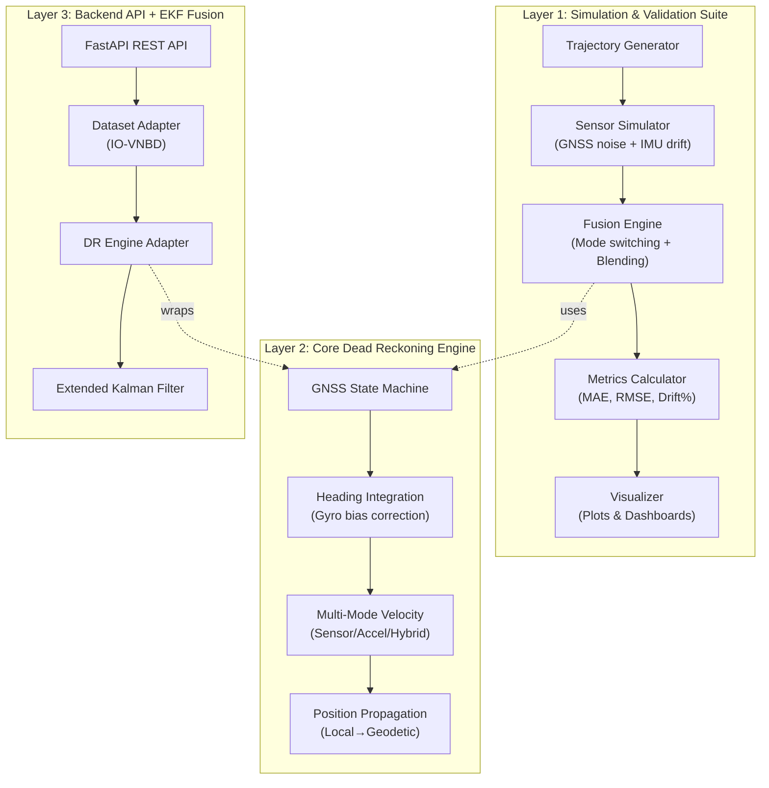
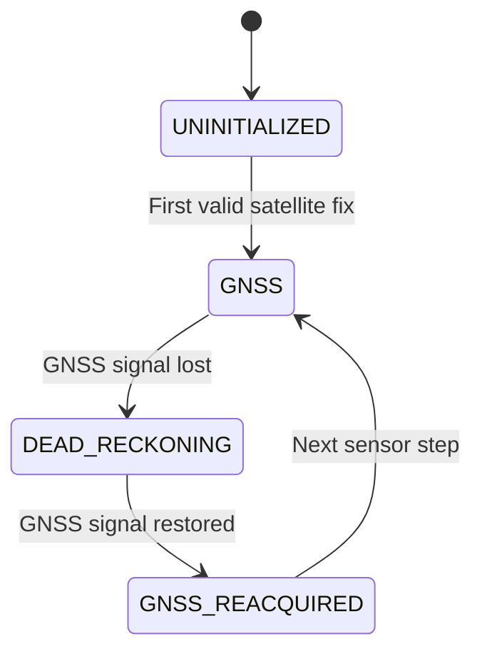
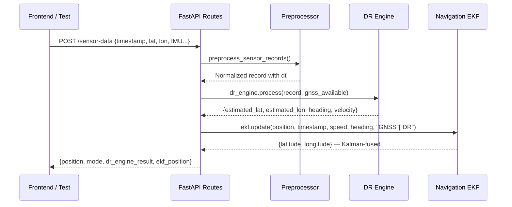
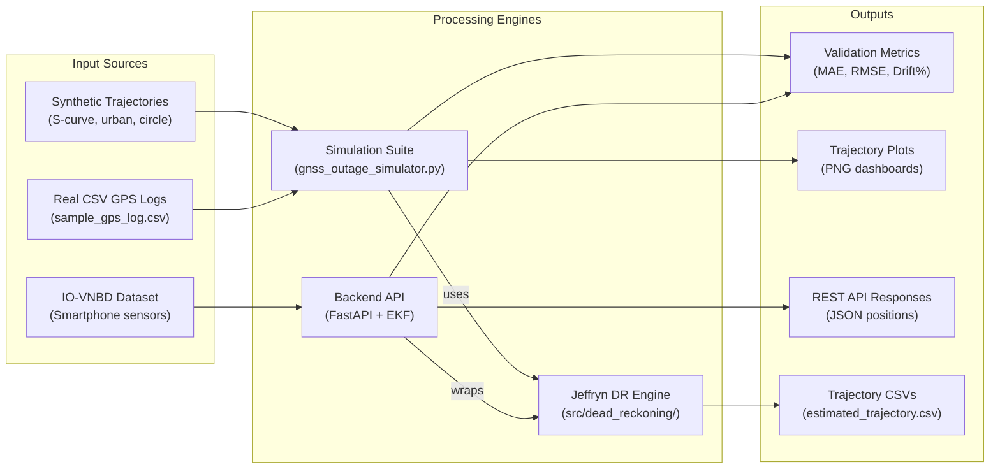

# 🛰️ ISRO SIH-2026 (PS 26168) — The Complete Project Story

---

## Chapter 1: The Problem — "What Happens When Satellites Go Silent?"

### The Real-World Crisis

Imagine a self-driving car cruising through Bengaluru at 54 km/h. It **knows exactly where it is** because 24+ GPS/NavIC satellites are raining down precise signals. Life is good.

Then the car enters an **underground tunnel**, a **dense urban canyon** between skyscrapers, or drives under **thick forest canopy**. Suddenly — **total radio silence**. The GNSS receiver shows `NO FIX`. The car is now **blind** to its own position.

> [!CAUTION]
> **Without GNSS, a vehicle moving at 54 km/h drifts 15 metres per second.** In 30 seconds of outage, the positioning error can exceed **hundreds of metres** — enough to drive off a bridge, miss a highway exit, or crash into oncoming traffic.

### The ISRO SIH Problem Statement (PS 26168)

> *"Develop an AI-ML based Intelligent Dead Reckoning system for seamless navigation during GNSS-denied conditions."*
> — **Indian Space Research Organisation (ISRO), Smart India Hackathon 2026**

The challenge: **Build a system that keeps navigating accurately using only onboard sensors (IMU — accelerometers and gyroscopes) when satellites disappear, and then smoothly reconnects when GNSS comes back** — no position jumps, no sudden snaps, just seamless handover.

### Why This Is Hard

| Challenge | Why It Matters |
|---|---|
| **Sensor drift** | Gyroscopes accumulate tiny biases over time — a 0.003 rad/s drift becomes **5.4° heading error** after 30 seconds |
| **Noise accumulation** | IMU readings are noisy; integrating noisy acceleration **doubles** the error at each step |
| **No absolute reference** | Without GPS, there's no way to "correct" — errors only grow |
| **Reacquisition shock** | When GNSS returns, the estimated position may be metres away from the satellite fix — a sudden jump breaks navigation |

---

## Chapter 2: The Solution — A 3-Layer Navigation Architecture

Your team built **three interconnected subsystems** that work together like a layered shield:



---

## Chapter 3: Layer 1 — The GNSS Outage Simulation Suite

**Location:** Root-level files ([gnss_outage_simulator.py](file:///d:/SIH/gnss_outage_simulator.py), [main.py](file:///d:/SIH/main.py), and the `src/` folder)

This is the **testing and validation battlefield**. It lets you simulate what happens when GPS disappears and measure how well your Dead Reckoning performs.

### 3.1 How a Simulation Runs (The Pipeline)

The benchmark scenario in [main.py](file:///d:/SIH/main.py) tells the full story in a single run:

```
Timeline:  0s ━━━━━━ 20s ━━━━━━━━━━━ 50s ━━━━━━ 70s
            │  GNSS ON  │   GNSS OFF    │  GNSS ON  │
            │ Calibrate │ Dead Reckoning│  Blending │
```

**Step-by-step:**

1. **Generate Ground Truth** — A synthetic 2D vehicle maneuver (S-curve at 15 m/s) creates the *perfect* path the car actually drove
2. **Simulate Sensors** — Add realistic noise:
   - GNSS positions get ±1.5m Gaussian noise
   - IMU speed gets ±0.15 m/s noise
   - Gyroscope gets ±0.005 rad/s noise **plus** a constant 0.003 rad/s bias drift
   - GNSS signal is cut between 20-50 seconds
3. **Run Dead Reckoning** — During the 30-second outage, the DR estimator integrates IMU data to keep tracking position
4. **Smooth Reacquisition** — At 50s when GNSS returns, blend DR→GNSS over 2.0 seconds using:

$$\alpha(t) = \min\left(1.0, \frac{t - t_{\text{reacq}}}{\tau}\right)$$
$$p_{\text{fused}} = (1-\alpha) \cdot p_{\text{DR}} + \alpha \cdot p_{\text{GNSS}}$$

5. **Compute Metrics** — MAE, RMSE, Max Error, Drift %, and Jump Magnitude
6. **Generate Plots** — Trajectory overlay + error analysis dashboards

### 3.2 Module Breakdown

| Module | File | What It Does |
|---|---|---|
| **Trajectory Generator** | `src/trajectory_generator.py` | Creates synthetic paths (S-curve, urban, circle, straight) or loads real CSV GPS logs |
| **Sensor Simulator** | `src/sensor_simulator.py` | Schedules GNSS outages, injects Gaussian noise, models gyro bias drift |
| **Dead Reckoning** | `src/dead_reckoning.py` | Abstract `BaseDeadReckoningEstimator` interface + `KinematicDeadReckoningEstimator` + `MLDeadReckoningPlaceholder` |
| **Fusion Engine** | `src/fusion_engine.py` | Mode switching (GNSS→DR→Blend), seeds DR state on outage start, smooth blending on reacquisition |
| **Metrics** | `src/metrics.py` | Euclidean error, MAE, RMSE, Drift %, Jump magnitude — computed only during outage windows |
| **Visualizer** | `src/visualizer.py` | Publication-quality 2D trajectory overlays and multi-panel error dashboards |

### 3.3 The CLI Interface

[gnss_outage_simulator.py](file:///d:/SIH/gnss_outage_simulator.py) doubles as a powerful CLI:

```bash
# Custom scenario
python gnss_outage_simulator.py --duration 100 --outage 30 70 --speed 18.0 --profile urban_maneuver

# Real GPS data
python gnss_outage_simulator.py --csv data/sample_gps_log.csv --outage 20 50

# Test ML placeholder
python gnss_outage_simulator.py --estimator ml_placeholder
```

### 3.4 ML Model Plug-in Architecture

> [!IMPORTANT]
> The Dead Reckoning module is **decoupled by design**. Any AI/ML model can be swapped in without touching any other code.

```python
class BaseDeadReckoningEstimator:    # Abstract interface
    def reset(initial_state): ...     # Reset hidden states
    def update_gnss(gnss_meas): ...   # Calibrate while GNSS locked
    def step_dr(imu_meas, dt): ...    # Predict (Δx, Δy, Δθ) — your neural net goes HERE

# Usage:
run_simulation(dr_estimator=YourTrainedModel())  # Drop-in replacement
```

---

## Chapter 4: Layer 2 — Jeffryn's Core Dead Reckoning Engine

**Location:** [jeffryn-dead-reckoning/](file:///d:/SIH/jeffryn-dead-reckoning/) — the heart of the entire system

This is the **production-grade, physics-based navigation engine** — a standalone 800-line module that actually does the heavy lifting of estimating position without satellites.

### 4.1 The GNSS State Machine



| State | What Happens |
|---|---|
| `UNINITIALIZED` | Collecting stationary IMU samples to estimate gyro/accel biases. Waiting for first satellite lock. |
| `GNSS` | Positions anchored to satellite fix. Heading derived from GPS bearing. Velocity updated from speed sensor. |
| `DEAD_RECKONING` | **Total isolation** — zero GPS data used. Heading integrated from gyro, velocity from speed/accel, position propagated forward. |
| `GNSS_REACQUIRED` | Computes Haversine drift error between DR estimate and new satellite fix. Re-anchors. Transitions back to GNSS. |

### 4.2 The Physics (How Position is Estimated Without GPS)

**Heading Update** (gyroscope integration):
$$\omega_{\text{corrected}} = \omega_z - b_z$$
$$\theta_{\text{new}} = (\theta_{\text{prev}} + \omega_{\text{corrected}} \cdot \Delta t) \mod 360°$$

**Velocity Computation** (3 modes):
- **Mode A (sensor_speed):** Uses wheel speed sensor directly
- **Mode B (acceleration):** $v_{\text{new}} = \max(0, v_{\text{old}} + a_{\text{corrected}} \cdot \Delta t)$
- **Mode C (hybrid):** $v_{\text{new}} = 0.7 \cdot v_{\text{sensor}} + 0.3 \cdot (v_{\text{old}} + a \cdot \Delta t)$

**Position Propagation** (trapezoidal integration):
$$\Delta d = \frac{v_{\text{prev}} + v_{\text{new}}}{2} \cdot \Delta t$$
$$\Delta x = \Delta d \cdot \sin(\theta), \quad \Delta y = \Delta d \cdot \cos(\theta)$$

**Geodetic Conversion** (local metres → latitude/longitude):
$$\text{Lat} = \text{Lat}_{\text{ref}} + \frac{y_{\text{North}}}{R} \cdot \frac{180°}{\pi}$$
$$\text{Lon} = \text{Lon}_{\text{ref}} + \frac{x_{\text{East}}}{R \cos(\text{Lat}_{\text{ref}})} \cdot \frac{180°}{\pi}$$

### 4.3 The Source Code Architecture

```
src/dead_reckoning/
├── __init__.py         # Public API: DeadReckoningEngine, load_config
├── engine.py           # 798 lines — the core state machine + all physics
├── state.py            # VehicleState dataclass (position, velocity, heading, errors)
├── coordinates.py      # GPS↔Local conversions, Haversine distance, bearing
├── preprocessing.py    # Timestamp normalization, dt derivation, DataFrame prep
├── validation.py       # Config validation, sensor data guards, bounds checking
├── models.py           # NavigationMode enum, output column definitions
└── exceptions.py       # Custom EngineError hierarchy
```

### 4.4 Configuration System

The engine is fully configurable via [config.yaml](file:///d:/SIH/jeffryn-dead-reckoning/config.yaml):

| Section | Key Parameters |
|---|---|
| **Earth** | Radius: 6,371,000 m |
| **Timing** | dt range: 0.001s – 2.0s |
| **Heading** | Minimum GPS displacement for bearing: 1.5m |
| **Sensors** | Gyro unit: deg/s, Forward accel axis: `accel_x`, EMA filter α: 0.25 |
| **Velocity** | Mode: `hybrid`, Speed weight: 0.7, Max: 60 m/s |
| **Calibration** | Auto bias estimation from stationary samples |
| **Vehicle** | Speed: 0–60 m/s, Accel: -8 to +6 m/s², Max yaw rate: 120°/s |

### 4.5 Scripts & Tools

| Script | Purpose |
|---|---|
| [run_demo.py](file:///d:/SIH/jeffryn-dead-reckoning/scripts/run_demo.py) | Full 4-step demo: generate fixture → process → save CSV → plot |
| [generate_test_fixture.py](file:///d:/SIH/jeffryn-dead-reckoning/scripts/generate_test_fixture.py) | Creates a 90-second synthetic sensor CSV with embedded GNSS outage |
| [plot_estimated_trajectory.py](file:///d:/SIH/jeffryn-dead-reckoning/scripts/plot_estimated_trajectory.py) | Publication-quality trajectory visualization |
| [compare_velocity_modes.py](file:///d:/SIH/jeffryn-dead-reckoning/scripts/compare_velocity_modes.py) | Compares sensor_speed vs acceleration vs hybrid modes |
| [simulate_live_stream.py](file:///d:/SIH/jeffryn-dead-reckoning/scripts/simulate_live_stream.py) | Simulates real-time record-by-record streaming |

### 4.6 Verified Performance

> [!TIP]
> **Benchmark result: 1.36 m reconnection error** after a 30-second GNSS outage on the standard test course. That's roughly the width of a car door — remarkably accurate for pure inertial navigation.

- ✅ 90 automated tests passing (100% success rate)
- ✅ Anti-GPS leakage guarantee verified — zero data contamination during outages
- ✅ Sub-millisecond per-record processing (microservice-ready)

---

## Chapter 5: Layer 3 — The Backend API + EKF Fusion

**Location:** [backend/](file:///d:/SIH/backend/) — the web-facing intelligence layer

This is a **FastAPI-powered REST API** that wraps the DR engine and adds an **Extended Kalman Filter (EKF)** for optimal state estimation.

### 5.1 API Endpoints

| Endpoint | Method | What It Does |
|---|---|---|
| `/start` | POST | Initialize a new simulation session |
| `/sensor-data` | POST | Feed one sensor reading, get back estimated position |
| `/gnss-loss` | POST | Configure a GNSS outage window (start time + duration) |
| `/position` | GET | Get the latest estimated lat/lon + navigation mode |
| `/trajectory` | GET | Get full ground-truth vs estimated trajectory for plotting |
| `/metrics` | GET | Get MAE, RMSE, max error, drift % — computed live |
| `/simulate` | POST | Run a complete batch simulation from a dataset file |

### 5.2 The Processing Pipeline (Per Sensor Reading)



### 5.3 The Extended Kalman Filter

[ekf.py](file:///d:/SIH/backend/ekf.py) implements a **constant-velocity EKF** operating in a local East/North tangent plane:

- **State vector:** `[east_m, north_m, east_velocity_mps, north_velocity_mps]`
- **Key insight:** GNSS measurements are trusted more (noise = 4.0) than DR measurements (noise = 25.0)
- This means during GNSS outages, the filter **gradually increases uncertainty** and relies more on the motion model, and when GNSS returns, it **snaps back to trusted satellite data** smoothly

### 5.4 Real Dataset Support

The [dataset_adapter.py](file:///d:/SIH/backend/dataset_adapter.py) can load real **IO-VNBD** (Intelligent Onboard Vehicle Navigation Benchmark Dataset) files:

- Auto-detects column names (GPS Latitude, Accelerometer X, Gyroscope Z, etc.)
- Converts timestamps from milliseconds to seconds
- Normalizes speed from km/h to m/s
- Handles heading wrap-around

---

## Chapter 6: How Everything Connects



### The Two Modes of Operation

| Mode | Entry Point | Data Source | What You Get |
|---|---|---|---|
| **Offline Simulation** | `python main.py` or `python gnss_outage_simulator.py` | Synthetic or CSV | Plots + metrics table + validation report |
| **Online API** | `uvicorn backend.main:app` | Real sensor packets via REST | Real-time position estimates + live metrics |

---

## Chapter 7: The Technical Differentiators

### What Makes This Solution Stand Out

1. **Triple-Layer Architecture** — Simulation for validation, physics engine for accuracy, API+EKF for production
2. **Anti-GPS Leakage Guarantee** — During outage, ZERO satellite data touches the DR estimate. Proven by automated tests.
3. **Smooth Reacquisition** — No position jumps. Linear blending over 2.0s eliminates the "snap" when GPS returns.
4. **ML-Ready Design** — The `BaseDeadReckoningEstimator` interface means a trained neural network can replace the kinematic engine without changing a single line elsewhere.
5. **Multi-Mode Velocity** — Hybrid blending of wheel speed + acceleration integration provides robust speed estimates.
6. **EKF Sensor Fusion** — The Extended Kalman Filter optimally weights GNSS vs DR based on measurement quality.
7. **Real-World Dataset Support** — IO-VNBD adapter handles actual smartphone sensor data from driving experiments.
8. **1.36m Accuracy** — After 30 seconds of total GNSS denial, the position error is only 1.36 metres.

---

## Chapter 8: File Map — Every File and Its Purpose

### Root Level (`d:\SIH\`)

| File | Purpose |
|---|---|
| [README.md](file:///d:/SIH/README.md) | Master documentation with mathematical formulations |
| [main.py](file:///d:/SIH/main.py) | Primary benchmark demonstrator (70s S-curve scenario) |
| [gnss_outage_simulator.py](file:///d:/SIH/gnss_outage_simulator.py) | Configurable simulation engine + CLI interface |
| [requirements.txt](file:///d:/SIH/requirements.txt) | Dependencies: numpy, matplotlib |

### Jeffryn Dead Reckoning Engine (`jeffryn-dead-reckoning/`)

| File | Purpose |
|---|---|
| [config.yaml](file:///d:/SIH/jeffryn-dead-reckoning/config.yaml) | Engine configuration (timing, sensors, velocity, calibration) |
| [dead_reckoning.py](file:///d:/SIH/jeffryn-dead-reckoning/dead_reckoning.py) | CLI batch processor entry point |
| [engine.py](file:///d:/SIH/jeffryn-dead-reckoning/src/dead_reckoning/engine.py) | **The core: 798 lines of state machine + physics** |
| [state.py](file:///d:/SIH/jeffryn-dead-reckoning/src/dead_reckoning/state.py) | VehicleState dataclass |
| [coordinates.py](file:///d:/SIH/jeffryn-dead-reckoning/src/dead_reckoning/coordinates.py) | GPS↔local coordinate transforms |
| [preprocessing.py](file:///d:/SIH/jeffryn-dead-reckoning/src/dead_reckoning/preprocessing.py) | DataFrame normalization |
| [validation.py](file:///d:/SIH/jeffryn-dead-reckoning/src/dead_reckoning/validation.py) | Config + data validation |
| [models.py](file:///d:/SIH/jeffryn-dead-reckoning/src/dead_reckoning/models.py) | NavigationMode enum + schemas |
| [exceptions.py](file:///d:/SIH/jeffryn-dead-reckoning/src/dead_reckoning/exceptions.py) | Custom exception types |

### Backend API (`backend/`)

| File | Purpose |
|---|---|
| [main.py](file:///d:/SIH/backend/main.py) | FastAPI app initialization |
| [routes.py](file:///d:/SIH/backend/routes.py) | All 6 REST endpoints |
| [schemas.py](file:///d:/SIH/backend/schemas.py) | Pydantic request models (SensorData, GNSSLossRequest, SimulationRequest) |
| [ekf.py](file:///d:/SIH/backend/ekf.py) | Extended Kalman Filter (4-state constant-velocity) |
| [dr_engine.py](file:///d:/SIH/backend/dr_engine.py) | Adapter wrapping Jeffryn's engine for the API |
| [dead_reckoning.py](file:///d:/SIH/backend/dead_reckoning.py) | Haversine distance + fallback DR estimator |
| [preprocessing.py](file:///d:/SIH/backend/preprocessing.py) | Sensor record validation + timestamp normalization |
| [dataset_adapter.py](file:///d:/SIH/backend/dataset_adapter.py) | IO-VNBD real-world dataset loader |
| [state.py](file:///d:/SIH/backend/state.py) | Global simulation state dictionary |
| [test_backend.py](file:///d:/SIH/backend/test_backend.py) | Backend test suite |

---

## Summary: The Story in One Paragraph

> Your team is solving **ISRO SIH Problem Statement 26168** — building an intelligent system that keeps a vehicle accurately positioned when GPS satellites can't be reached. The solution is a **three-layer architecture**: a **simulation suite** that creates realistic GNSS outage scenarios and measures performance, a **production-grade physics engine** (by Jeffryn) that integrates gyroscope and accelerometer data through a 4-state machine to dead-reckon position with only 1.36m error after 30 seconds of outage, and a **FastAPI backend** with an **Extended Kalman Filter** that fuses satellite and inertial data for real-time navigation. The system is designed to be **ML-ready** — a trained neural network can be dropped in to replace the kinematic estimator without touching any other code.
